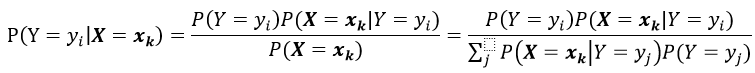

## 生成式模型和判别式模型：朴素贝叶斯和逻辑斯提回归

#### Generative and discriminative classifiers: Naive Bayes and Logistic Regression

这是一份基于Tom M. Mitchell机器学习课程的笔记。

------

1. ##### 通过贝叶斯公式的思想来学习一个*生成式模型*，分类器。

   

   	*大写的英文字母代表随机变量，而粗体代表向量。*

   - ##### 没有**偏好**的去学习贝叶斯分类器是不切实际的。

     > ##### 根据上面的公式，要想学习一个贝叶斯分类器，我们需要估计多少个参数？
     >
     > 首先，假设我们要得到一个生成式模型；用白话来说就是，我们通过计算类条件似然P(**X**|Y)、先验概率P(Y)和贝叶斯公式来得到我们感兴趣的后验概率P(Y|**X**)，基于这个后验概率我们能够对未来的观测点进行分类。
     >
     > 在计算类条件概率P(**X**|Y)时需要估计2(2^n-1)个参数，非常大的一个数字，通常我们的训练样本都没有那么多。(摘录自*西瓜书：类条件概率是所有属性上的联合概率，在有限的训练样本上时很难直接估计得到的，或者说：**很多P(X|Y)是无法计算的，因为他们还没有被观测到**。)
     >
     > 没有偏好的学习贝叶斯分类器需要面对非常大的样本复杂度。

2. ##### 朴素贝叶斯

   - ##### 条件独立

   - > ##### 定义：给定三个随机变量X，Y，Z；我们说X是条件独立于Y，Z的 <=> P(X|Y,Z) = P(X|Y)

   - ##### 朴素贝叶斯

     ##### 

     

   - ##### 离散变量输入/连续变量输入

     - ##### 估计类条件概率，可以理解为：在事先知道或者只是猜测某个变量可能的概率分布种类的基础上，在训练数据上尽可能的近似该概率分布；然后，在得到的概率分布上建立朴素贝叶斯模型，对新的观测点分类。上述的过程可以理解为一个学习的过程。

       - > ##### 举例来说，我们假设某个变量的分布是正态分布的，那么估计概率密度函数，就需要计算某个变量在某个标签下的均值和方差。而在计算离散属性的概率分布时，只需要简单的计数就好可以得到。

3. ##### 逻辑斯提回归

   > ##### 直接从训练集中估计P(Y|X)，是一个*判别式模型*。

   - ##### 估计逻辑斯提回归的参数

     估计逻辑斯提回归的参数可以使用凸优化理论中的经典数值优化算法，如梯度下降法，牛顿法，梯度上升法等等。上面的这些优化算法，不需要朴素贝叶斯的假设，相比较而言，就是多了方差，少了偏差（偏见）。

   - ##### 逻辑斯提回归加上正则化

     逻辑回归中会出现过拟合训练数据的问题，特别是当数据维度很高但数据却非常稀疏的时候。改善这个问题的办法是加入一个正则化项：

     对参数W的取值是令每个类属于其真实标记的概率越大越好，同时加入一个惩罚项，特别当W的取值很大时会产生影响。详细的正则化在机器学习中扮演的角色，在后续的笔记提及。

   - ##### 多分类的逻辑斯提回归

4. ##### 朴素贝叶斯和逻辑斯提回归之间的关系

5. ##### 重要的知识点

   ##### 

   ##### 	

   ##### 

