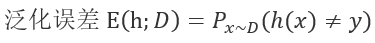
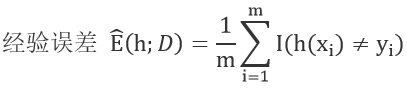
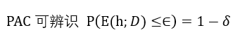

## 计算学习理论  Computational learning theorey

> 如何获得分类器一般化的保证（Generalization Guarantees）

如何从训练集中泛化我们所看到的观测点是机器学习的重点，甚至可以说泛化的能力造就了机器学习。下面的部分/这份笔记的内容将简明地讨论计算学习理论。

[^笔记来源]: 包括Tom Mitchell cs-10-601，和周志华老师西瓜书。

> 目标概念 = 目标函数

[TOC]

## 1. 假设空间

> 西瓜书p270，假设空间H越大，其包含任意目标概念的可能性越大，但从中找到某个具体目标概念的难度也越大。

- 有限假设空间
  - 可分的（separable）或称为一致的（consistent）
    - *c*∈H，白话：假设空间中有一个假设可以将训练集中的观测点完美的按照其标签分开。
  - 不可分的（non-separable）
    - c∉H
    - 处理：Hoeffding 不等式推导，见练习。
- 无限假设空间
  - 比如d维空间的所有线性超平面。
  - 解决无限假设空间的**大概近似正确**可学习问题，详见VC维。
- 泛化误差/经验误差（也称训练误差）

## 2. PAC Theorey  (Probably Approximately Correct)

- 用我的话说 PAC Theorey

  某个学习算法能够从假设空间H中**大概近似正确地**识别目标概念*c*。

  那么，我们定义这个学习算法的泛化误差小于 *ϵ* 的概率等于（1-*δ*）；也就是，这个学习算法有（1-δ）的可能性可以近似目标概念*c*，并且相差不超过*ϵ* 。

- 实际上可以分为三种

  - PAC可辨识

    某个学习算法的假设空间H可以**大概近似正确地**识别目标概念*c*

    

    其中，*ϵ* < 0，*δ*>1，*D* 为某个特定的分布。

  - PAC可学习

    若某个学习算法可以**通过大于等于poly(1/*ϵ* ,1/δ, size(x), size(c))的样本数来PAC辨识目标概念**，则称目标概念 *c* 是可以**大概近似正确的**被学习算法假设空间所学习的。

    

  - PAC学习算法

    若某个学习算法使得目标概念*c*是PAC可学习的，且算法的时间复杂度是一个多项式函数poly(1/*ϵ* ,1/δ, size(x), size(c))，则称目标概念是可以**大概近似正确的**被**高效**学习的，并且这个算法是一个**大概近似正确的**学习算法。

  - 样本复杂度

    满足PAC学习算法的最小的样本数，就是这个学习算啊发的样本复杂度。

## 2. VC维

> - 处理现实中常见的无限假设空间，针对二分类问题
>
> - VC dimension：Vapnik-Chervonenkis dimension [Vapnik and Chervonenkis, 1971]
>
> - 基于VC维定义的泛化误差是与数据分布无关的
> - 增长函数（Growth Function）
> - 对分（dichotomy）
> - 打散（shattering）

- Sauer lemma：VC维和增长函数之间的定量关系
- 经验风险最小化 Empirical Risk Minimization, ERM

## 3. Rademacher复杂度

> 另一种描述假设空间的方法，与VC维不同的是：考虑了数据分布。
>
> Jensen不等式
>
> McDiarmid不等式

## 4. 稳定性

> 考察：当输入发生变化时，输出是否会随之发生较大的变化？

## 5. 练习

- 不可分假设空间对PAC可学习理论的推导
- （12.6）决策树分类器的假设空间VC维可以是无穷大
- （12.7）最近邻分类器的假设空间VC维可以是无穷大