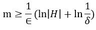

## 计算学习理论  Computational learning theorey

> 如何获得分类器一般化的保证（Generalization Guarantees）

如何从训练集中泛化我们所看到的观测点是机器学习的重点，甚至可以说泛化的能力造就了机器学习。下面的部分/这份笔记的内容将简明地讨论计算学习理论。

[^笔记来源]: 包括Tom Mitchell cs-10-601，和周志华老师西瓜书。

> 目标概念 = 目标函数

[TOC]

## 1. 假设空间

- 有限假设空间
  - 可分的（separable）或称为一致的（consistent）
  - 不可分的（non-separable）
- 无限假设空间

## 2. PAC Theorey(Probably Approximately Correct)

- 泛化误差/经验误差（也称训练误差）

- 用我的话说PAC Theorey

  某个学习算法能够从假设空间H中**大概近似正确地**识别目标概念*c*。

  那么，我们定义这个学习算法的泛化误差小于 *ϵ* 的概率等于（1-*δ*）；也就是，这个学习算法有（1-δ）的可能性可以近似目标概念*c*，并且相差不超过*ϵ* 。

- 实际上可以分为三种

  - PAC可辨识

    某个学习算法的假设空间H可以**大概近似正确地**识别目标概念*c*

    

    其中，*ϵ* < 0，*δ*>1，*D* 为某个特定的分布。

  - PAC可学习

    若某个学习算法可以**通过大于等于poly(1/*ϵ* ,1/δ, size(x), size(c))的样本数来PAC辨识目标概念**，则称目标概念 *c* 是可以**大概近似正确的**被学习算法假设空间所学习的。

    

  - PAC学习算法

    若某个学习算法使得目标概念*c*是PAC可学习的，且算法的时间复杂度是一个多项式函数poly(1/*ϵ* ,1/δ, size(x), size(c))，则称目标概念是可以**大概近似正确的**被**高效**学习的，并且这个算法是一个**大概近似正确的**学习算法。

  - 样本复杂度

    满足PAC学习算法的最小的样本数，就是这个学习算啊发的样本复杂度。

## 2. VC维

## 3. Rademacher复杂度

## 4. 稳定性